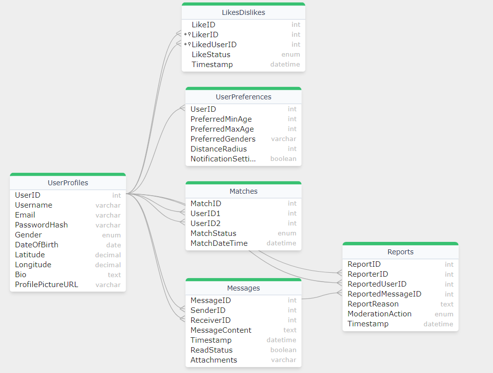

# Dating App Database Schema Design
Database schema design for a dating application using both **SQL** and **NoSQL** databases is presented below.

The app aims to connect users based on their preferences, interests, location, and other relevant criteria.
The database design is built to efficiently store user profiles, match data, messaging history, and
application settings.

## SQL Approach

## Entity - Relationship Diagram (ERD)

  
   

Here's the ERD for the dating app based on the described schema:

### Entities:

1. UserProfiles
2. UserPreferences
3. Matches
4. Messages
5. Likes
6. Reports (Optional)

### Relationships:

**UserProfiles**: Central entity with attributes like user ID, username, email, etc.

**UserPreferences**: One-to-One relationship with Users, stores preferences like age range, gender preference, etc. (Foreign Key: UserID references UserProfiles(UserID))

**Matches**: Many-to-Many relationship between Users, stores information about matched users (user IDs, status, timestamp). (Foreign Keys: UserID1 and UserID2 both reference UserProfiles(UserID))

**Messages**: Many-to-Many relationship between Users, stores message content, sender/receiver IDs, timestamps, and read status. (Foreign Keys: SenderID and ReceiverID both reference UserProfiles(UserID))

**Likes**: One-to-Many relationship with Users, stores like/dislike information (user ID, liked user ID, status, timestamp). (Foreign Keys: LikerID and LikedUserID both reference UserProfiles(UserID))

**Reports (Optional)**: One-to-Many or Many-to-Many relationships with Users and Messages (depending on implementation), stores reporting details. (Foreign Keys: ReporterID references UserProfiles(UserID), ReportedMessageID references Messages(MessageID) - optional)

### Cardinalities:

**UserProfiles**: Many (can have many relationships)

**UserPreferences**: One (one set of preferences per user)

**Matches**: Many (a user can have many matches)

**Messages**: Many (a user can send and receive many messages)

**Likes**: Many (a user can like/dislike many profiles)

**Reports (Optional)**: Many (a user can submit many reports, a message/user can be reported by many users)

### Attributes:

Each entity will have its specific attributes as defined in the database schema.

## NoSQL Approach

### Entity-Relationship Model (NoSQL Approach)

In NoSQL databases like DynamoDB, we typically denormalize data to optimize for query performance and scalability. We'll design each table to suit specific access patterns and query requirements.

### Entities:

1. User Profiles
2. User Preferences
3. Matches
4. Messages
5. Likes/Dislikes
6. Reporting/Moderation

### DynamoDB Table Design:

1. User Profiles Table:
   - Partition Key: UserID (String)
   - Attributes:
     - Username (String)
     - Email (String)
     - PasswordHash (String) (Hashed securely using a strong algorithm)
     - Gender (String)
     - DateOfBirth (String or Number)
     - Location (Map): {Latitude: Number, Longitude: Number} (Geo point data type for location)
     - Bio (String)
     - ProfilePictureURL (String)
   - Secondary Indexes: None
   
2. User Preferences Table:
   - Partition Key: UserID (String)
   - Attributes:
     - PreferredMinAge (Number)
     - PreferredMaxAge (Number)
     - PreferredGenders (String Set)
     - DistanceRadius (Number)
     - NotificationSettings (Boolean)
   - Secondary Indexes: None

3. Matches Table:
   - Partition Key: MatchID (String or Number)
   - Attributes:
     - UserID1 (String)
     - UserID2 (String)
     - MatchStatus (String) - "pending", "accepted", or "declined"
     - MatchDateTime (String or Number)
   - Secondary Indexes: None

4. Messages Table:
   - Partition Key: ConversationID (String)
   - Sort Key: Timestamp (String or Number)
   - Attributes:
     - SenderID (String) - References User Profiles table
     - ReceiverID (String) - References User Profiles table
     - MessageContent (String)
     - ReadStatus (Boolean)
     - Attachments (String Set)
   - Secondary Indexes: None

5. Likes/Dislikes Table:
   - Partition Key: UserID (String)
   - Sort Key: LikedUserID (String) - Ensures uniqueness for a like/dislike on a profile
   - Attributes:
     - LikeStatus (String) - "like" or "dislike"
     - Timestamp (String or Number)
   - Secondary Indexes: None

6. Reporting/Moderation Table:
   - Partition Key: ReportID (String or Number) - Unique identifier for the report
   - Attributes:
     - ReporterID (String) - References User Profiles table
     - ReportedUserID (String) - References User Profiles table
     - ReportedMessageID (String) - References Messages table
     - ReportReason (String)
     - ModerationAction (String) - "pending", "warning", or "suspended"
     - Timestamp (String or Number)
   - Secondary Indexes: None

* NOTE: [For documentation and rationale behind the design, refer this link](https://github.com/SahibSodhi/Dating-App/blob/main/Documentation.txt)

